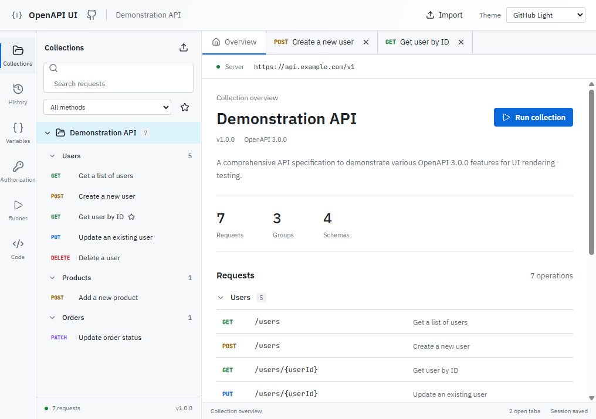
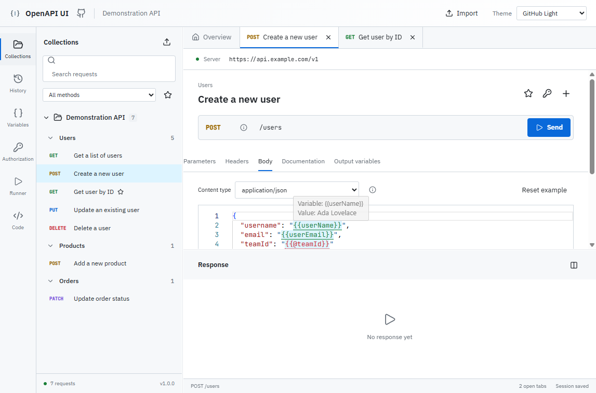
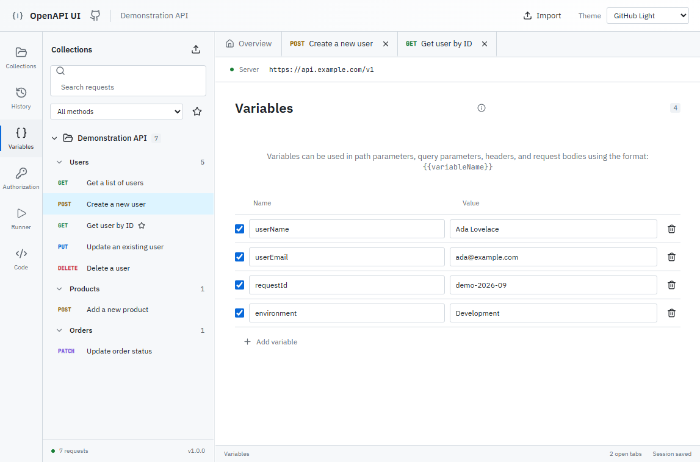
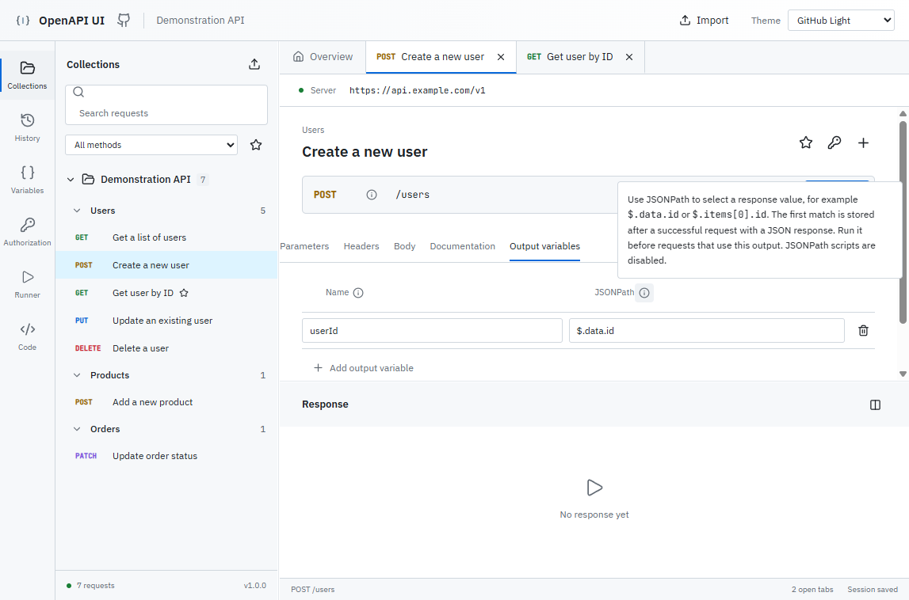
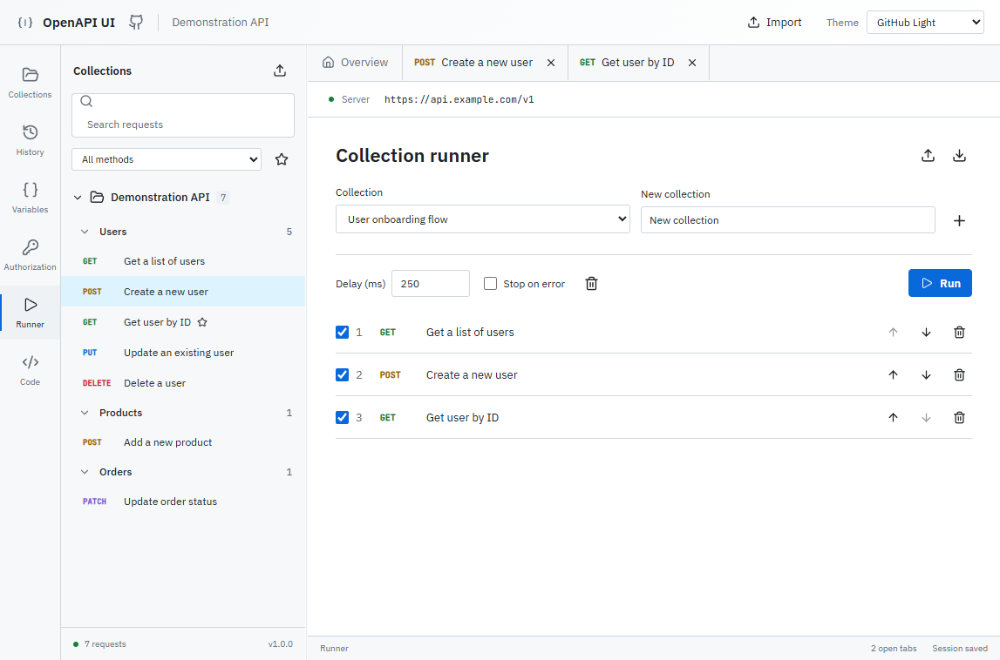
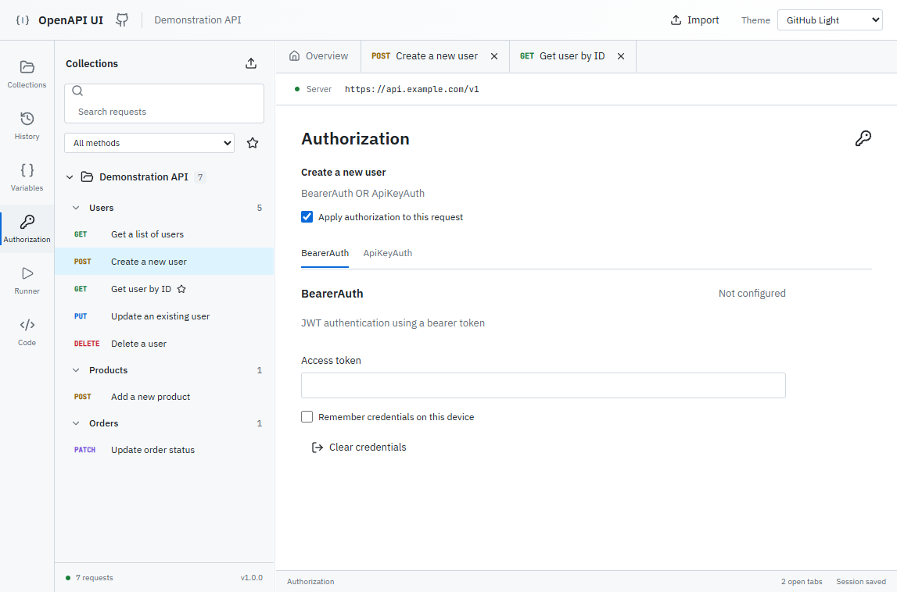

# OpenAPI UI

OpenAPI UI is an interactive workspace for exploring, testing and automating OpenAPI APIs. It runs as a standalone web application, ASP.NET Core middleware and a VS Code extension.

[Live demo](https://jakubkozera.github.io/openapi-ui/)



## Highlights

- React workspace with searchable collections, HTTP method filters and favorites
- Persistent request tabs with independent drafts and session restoration
- OpenAPI 3.x and Swagger 2.0 import from URL, file or pasted JSON/YAML
- Request editing for path, query, header, cookie, JSON, XML, text and multipart data
- Response status, timing, size, headers, body preview and file download
- Bearer, Basic, API key, OAuth2 and OpenID Connect authorization
- Environment variables and response output variables with JSONPath extraction
- Monaco variable highlighting and hover previews for `{{variable}}` and `{{@output}}`
- Collection runner with ordering, delay, cancellation, stop-on-error and variable chaining
- Request snippets and configurable C# and JavaScript/TypeScript client generation
- Standalone themes and native VS Code light, dark and high-contrast theme support

## Request Workspace

Every operation opens in a persistent tab. Secured operations show a key action in the request header that opens the shared Authorization view. Public operations do not display it.

Variables can be used in the server URL, request path, parameters, headers, forms and request body. Monaco distinguishes resolved variables, pending outputs and missing values. Hovering a reference shows the value that will be substituted.



## Variables

Create reusable values in the Variables view and reference them with `{{variableName}}`. Disabled or undefined variables remain unresolved when a request is sent.



To extract a value from a JSON response, define an output name and JSONPath on the source request. A later request can reference it with `{{@outputName}}`. JSONPath scripts are disabled, and the first match is stored after a successful response.



## Collection Runner

The runner executes saved requests in order and carries extracted output values into later requests. Collections support request enablement, reordering, delay, cancellation, stop-on-error, import and export.



## Authorization

Authorization follows OpenAPI operation-level overrides and AND/OR security requirements. Credentials are kept in memory unless persistence is explicitly enabled. Request history never stores response bodies or credentials.



## ASP.NET Core Integration

Install the NuGet package:

```bash
dotnet add package OpenApiUi
```

Register the middleware after the OpenAPI document endpoint:

```csharp
using OpenApiUi;

var builder = WebApplication.CreateBuilder(args);

builder.Services.AddControllers();
builder.Services.AddEndpointsApiExplorer();
builder.Services.AddSwaggerGen();

var app = builder.Build();

app.UseSwagger();
app.UseOpenApiUi();

app.UseHttpsRedirection();
app.UseAuthorization();
app.MapControllers();

app.Run();
```

Open `/openapi-ui` in the browser. The default specification path is `/swagger/v1/swagger.json`; pass a custom path when needed:

```csharp
app.UseOpenApiUi("/api/docs/swagger.json");
```

The middleware targets .NET 6, 8, 9 and 10.

## Distribution

### Standalone Core

The core build emits static `index.html`, `bundle.js` and `bundle.css` assets. It can be hosted without a React runtime in the consuming application.

### ASP.NET Core

The `OpenApiUi` NuGet package embeds the built UI and serves it through ASP.NET Core middleware.

### VS Code

The extension runs the same UI in a webview, maps VS Code theme tokens, persists workspace state and proxies HTTP requests to avoid browser CORS restrictions.

## Development

Node.js 22.12 or newer is required.

```bash
npm ci --prefix src/core
npm test --prefix src/core
npm run typecheck --prefix src/core
npm run build --prefix src/core
npm run build:demo --prefix src/core
```

Start the React development server:

```bash
npm run dev --prefix src/core
```

Run the local ASP.NET Core sample:

```bash
dotnet run --project src/c-sharp/OpenApiUi.Sample
```

Build and validate the VS Code extension:

```bash
npm run compile-tests --prefix src/vsc-extension/openapi-ui
npm run lint --prefix src/vsc-extension/openapi-ui
npm run compile --prefix src/vsc-extension/openapi-ui
```

See [React core development](src/core/README.md) for persistence contracts, security details, build synchronization and test coverage.

## Troubleshooting

### UI does not load

- Confirm that the OpenAPI document endpoint is available before `UseOpenApiUi` runs.
- Check the configured specification path in the browser network panel.
- Verify that the application URL works both with and without a trailing slash.

### Static assets return 404

- Confirm that the middleware is registered in the request pipeline.
- Rebuild the core to synchronize generated assets into the NuGet and VS Code hosts.
- Do not edit generated bundles directly.

## License

This project is licensed under the MIT License.
