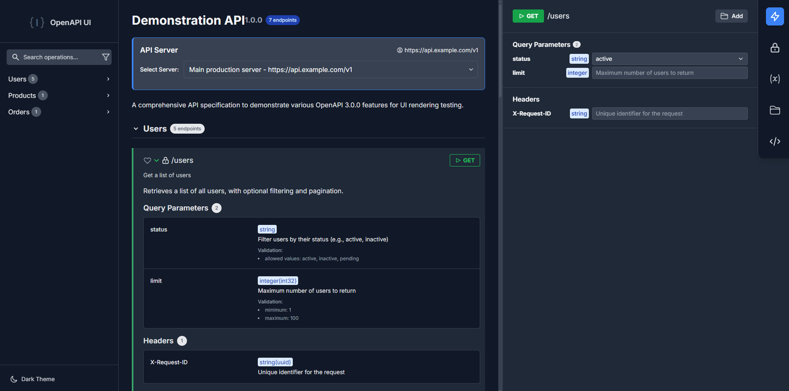
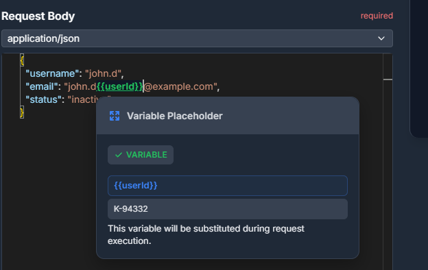
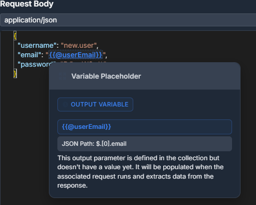

# OpenAPI UI

A modern, feature-rich OpenAPI/Swagger documentation and testing interface with advanced functionality for API development and testing.

## 🚀 Features

### Core Features

- 🚀 **Easy Integration** - Simple one-line setup in your ASP.NET Core application
- 📱 **Modern UI** - Clean, responsive interface for API documentation
- 🔍 **Easy Navigation** - Search and filter options for quick endpoint discovery
- 📋 **Comprehensive Endpoint Documentation** - Detailed API docs with requirements, parameters, and schemas
- ⚡ **Try It Out Section** - Interactive API testing directly from the documentation
- 🔐 **Authentication Options** - Built-in support for various authentication schemes (Bearer Token, Basic Auth, API Key, OAuth2, OpenID Connect)
- **Real-time Response Viewing** - Immediate feedback with formatted response data



### Advanced Features

#### 🏃‍♂️ Collection Runner (Postman-like)

- 🏃 **Collection Runner** - Execute multiple API requests in sequence for testing workflows


- Variable extraction and chaining between requests




- **Output Parameters** - Extract values from responses for reuse




#### 🔧 Developer Tools

- 📝 **Code Snippets Generation** - Auto-generate code examples in multiple programming languages
- 🛠️ **API Client Generation** - Generate complete API client libraries for different platforms (C#, JavaScript/TypeScript)
- **Monaco Editor Integration** - Advanced code editing with syntax highlighting
- **Variables Management** - Define and manage environment variables

#### 🎯 User Experience

- **Favorites System** - Bookmark frequently used endpoints
- 🔍 **Search & Filtering** - Quickly find endpoints and operations
- 🎨 **Theme Support** - Light and dark themes
- 📱 **Responsive Design** - Works seamlessly on desktop and mobile devices
- 🔧 **Customizable** - Embedded CSS and JavaScript that can be themed

#### 📊 Navigation & Organization

- **Smart Sidebar** - Collapsible navigation with search functionality
- **Endpoint Grouping** - Organized by tags and paths
- **Quick Access** - Jump to specific operations instantly
- **Breadcrumb Navigation** - Always know where you are in the API

## 🎮 Demo

Want to try OpenAPI UI before integrating it into your project? Check out our live demo:

**[🚀 Try it yourself at https://jakubkozera.github.io/openapi-ui/](https://jakubkozera.github.io/openapi-ui/)**

The demo showcases all the features mentioned above with a sample API specification, so you can:

- Explore the modern UI and navigation
- Test the interactive API functionality
- Try out the Collection Runner
- Experience the authentication features
- Generate code snippets and API clients
- See the variable management in action

No installation required - just open the link and start exploring!

## 🛠 Distribution Formats

OpenAPI UI is available in multiple formats to suit different integration needs:

### Standalone Core

- Pure HTML/CSS/JavaScript implementation
- No dependencies on specific frameworks
- Easy to embed in any web application
- Self-contained single-file distribution available

### ASP.NET Core Integration

- 📦 **NuGet package**: `JakubKozera.OpenApiUi`
- 🚀 **Seamless integration** with ASP.NET Core applications
- 🔧 **Middleware support** for easy setup
- ⚙️ **Compatible** with existing Swagger/OpenAPI pipelines
- 📦 **Self-Contained** - All assets embedded in the NuGet package
- 🌐 **Multi-Framework Support** - Compatible with .NET 6.0, 8.0, and 9.0

### Demo Mode

- Standalone demo with sample API specifications
- Perfect for testing and evaluation
- No backend required

## 🚀 Quick Start

### ASP.NET Core Integration

1. Install the NuGet package:

```bash
dotnet add package JakubKozera.OpenApiUi
```

Or via Package Manager Console in Visual Studio:

```powershell
Install-Package JakubKozera.OpenApiUi
```

2. Add to your `Program.cs` (or `Startup.cs` for older versions):

```csharp
using JakubKozera.OpenApiUi;

var builder = WebApplication.CreateBuilder(args);

// Add services to the container
builder.Services.AddControllers();
builder.Services.AddEndpointsApiExplorer();
builder.Services.AddSwaggerGen();

var app = builder.Build();

// Configure the HTTP request pipeline
if (app.Environment.IsDevelopment())
{
    app.UseSwagger();
    app.UseSwaggerUI();
}

// Add OpenAPI UI middleware
app.UseOpenApiUi(); // Uses default path "/swagger/v1/swagger.json"

app.UseHttpsRedirection();
app.UseAuthorization();
app.MapControllers();

app.Run();
```

3. Access the OpenAPI UI

Navigate to `/openapi-ui` in your browser to view the API documentation interface.

### Custom OpenAPI Specification Path

You can specify a custom path to your OpenAPI specification:

```csharp
app.UseOpenApiUi("/api/docs/swagger.json");
```

## Requirements

- .NET 6.0, 8.0, or 9.0
- ASP.NET Core application
- OpenAPI/Swagger specification endpoint

## Troubleshooting

### OpenAPI UI not loading

1. Ensure the middleware is added after `UseSwagger()` if you're using Swashbuckle
2. Check that your OpenAPI specification path is correct and accessible
3. Verify the middleware is registered in the request pipeline

### Custom OpenAPI path not working

Make sure the path you specify in `UseOpenApiUi()` matches your actual OpenAPI specification endpoint.

### Static assets not loading

The static assets are served from embedded resources. If they're not loading, check the browser's developer tools for 404 errors and verify the middleware is properly configured.

## 📄 License

This project is licensed under the MIT License - see the LICENSE file for details.

## 🆘 Support

- 📖 [Documentation](https://github.com/your-repo/openapi-ui/wiki)
- 🐛 [Issue Tracker](https://github.com/your-repo/openapi-ui/issues)
- 💬 [Discussions](https://github.com/your-repo/openapi-ui/discussions)

## 🌟 Why Choose OpenAPI UI?

- **Modern Architecture** - Built with modern web standards
- **Rich Feature Set** - Goes beyond basic documentation
- **Developer Focused** - Tools that developers actually need
- **Easy Integration** - Multiple distribution formats
- **Active Development** - Continuously improved and updated
- **Performance Optimized** - Fast loading and smooth interactions

Transform your API documentation from static pages into a powerful development tool with OpenAPI UI!
