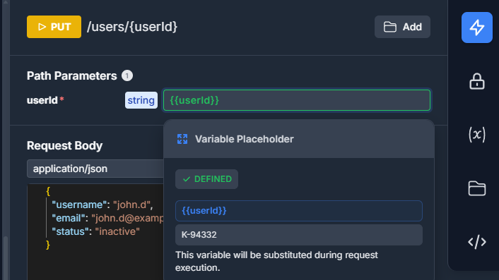

# JakubKozera.OpenApiUi

[](https://www.nuget.org/packages/JakubKozera.OpenApiUi/)
[](https://www.nuget.org/packages/JakubKozera.OpenApiUi/)

A .NET library that provides a modern, customizable OpenAPI UI interface for ASP.NET Core applications. This package serves an embedded HTML/CSS/JavaScript-based OpenAPI documentation interface that can be easily integrated into your ASP.NET Core web applications.

## 🎮 Demo

Want to try OpenAPI UI before integrating it into your project? Check out our live demo:

**[🚀 Try it yourself at https://jakubkozera.github.io/openapi-ui/](https://jakubkozera.github.io/openapi-ui/)**

The demo showcases all the features mentioned above with a sample API specification, so you can:

- Explore the modern UI and navigation
- Test the interactive API functionality
- Try out the Collection Runner
- Experience the authentication features
- Generate code snippets and API clients
- See the variable management in action

No installation required - just open the link and start exploring!

## Features

- 🚀 **Easy Integration** - Simple one-line setup in your ASP.NET Core application
- 📱 **Modern UI** - Clean, responsive interface for API documentation
- 🔍 **Easy Navigation** - Search and filter options for quick endpoint discovery
- 📋 **Comprehensive Endpoint Documentation** - Detailed API docs with requirements, parameters, and schemas
- ⚡ **Try It Out Section** - Interactive API testing directly from the documentation
- 🔐 **Authentication Options** - Built-in support for various authentication schemes (Bearer Token, Basic Auth, API Key, OAuth2, OpenID Connect)
- **Real-time Response Viewing** - Immediate feedback with formatted response data


### Advanced Features

#### 🏃‍♂️ Collection Runner (Postman-like)

- 🏃 **Collection Runner** - Execute multiple API requests in sequence for testing workflows


- Variable extraction and chaining between requests





- **Output Parameters** - Extract values from responses for reuse


## Installation

Install the package via NuGet Package Manager:

```bash
dotnet add package JakubKozera.OpenApiUi
```

Or via Package Manager Console in Visual Studio:

```powershell
Install-Package JakubKozera.OpenApiUi
```

## Quick Start

### 1. Add the middleware to your ASP.NET Core application

In your `Program.cs` (or `Startup.cs` for older versions):

```csharp
using JakubKozera.OpenApiUi;

var builder = WebApplication.CreateBuilder(args);

// Add services to the container
builder.Services.AddControllers();
builder.Services.AddEndpointsApiExplorer();
builder.Services.AddSwaggerGen();

var app = builder.Build();

// Configure the HTTP request pipeline
if (app.Environment.IsDevelopment())
{
    app.UseSwagger();
    app.UseSwaggerUI();
}

// Add OpenAPI UI middleware
app.UseOpenApiUi(); // Uses default path "/swagger/v1/swagger.json"

app.UseHttpsRedirection();
app.UseAuthorization();
app.MapControllers();

app.Run();
```

### 2. Access the OpenAPI UI

Navigate to `/openapi-ui` in your browser to view the API documentation interface.

## Configuration

### Custom OpenAPI Specification Path

You can specify a custom path to your OpenAPI specification:

```csharp
app.UseOpenApiUi("/api/docs/swagger.json");
```

## Usage Examples

### Basic Setup with Swagger

```csharp
var builder = WebApplication.CreateBuilder(args);

builder.Services.AddControllers();
builder.Services.AddEndpointsApiExplorer();
builder.Services.AddSwaggerGen(c =>
{
    c.SwaggerDoc("v1", new OpenApiInfo
    {
        Title = "My API",
        Version = "v1",
        Description = "A sample API for demonstration"
    });
});

var app = builder.Build();

// add OpenUI specification
app.UseSwagger();

// add OpenAPI UI
app.UseOpenApiUi();

app.UseHttpsRedirection();
app.UseAuthorization();
app.MapControllers();

app.Run();
```

## Requirements

- .NET 6.0, 8.0, or 9.0
- ASP.NET Core application
- OpenAPI/Swagger specification endpoint

## Troubleshooting

### OpenAPI UI not loading

1. Ensure the middleware is added after `UseSwagger()` if you're using Swashbuckle
2. Check that your OpenAPI specification path is correct and accessible
3. Verify the middleware is registered in the request pipeline

### Custom OpenAPI path not working

Make sure the path you specify in `UseOpenApiUi()` matches your actual OpenAPI specification endpoint.

## Contributing

This project is part of the [openapi-ui](https://github.com/jakubkozera/openapi-ui) repository. Contributions are welcome!

## License

This project is licensed under the MIT License - see the repository for details.

## Author

**Jakub Kozera**

- GitHub: [@jakubkozera](https://github.com/jakubkozera)
- Repository: [openapi-ui](https://github.com/jakubkozera/openapi-ui)
