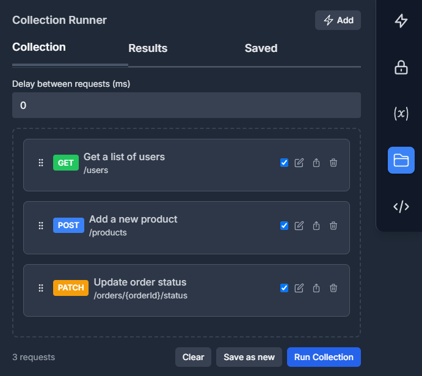

# OpenAPI UI - VS Code Extension

A powerful Visual Studio Code extension that provides an intuitive interface for viewing and managing OpenAPI specifications directly within your development environment.

## Features

- 🔍 **OpenAPI Viewer**: Interactive UI for browsing OpenAPI specifications
- 📁 **Source Management**: Add, remove, and organize multiple OpenAPI sources
- 🌐 **URL Support**: Load OpenAPI specs from remote URLs or local files
- 🎯 **Activity Bar Integration**: Dedicated sidebar for quick access to your API sources
- ⚡ **Real-time Loading**: Dynamic loading of OpenAPI specifications
- 🔄 **Refresh Support**: Update your API sources on demand

## Installation

### From VS Code Marketplace

1. Open VS Code
2. Go to Extensions (Ctrl+Shift+X)
3. Search for "OpenAPI UI"
4. Click Install

### Manual Installation

1. Clone this repository
2. Navigate to the extension directory
3. Run `npm install` to install dependencies
4. Press `F5` to launch a new Extension Development Host window

## Usage

### Getting Started

1. **Open the OpenAPI UI Panel**

   - Click on the OpenAPI UI icon in the Activity Bar
   - Or use Command Palette (Ctrl+Shift+P) and search for "Open OpenAPI UI"

2. **Add an OpenAPI Source**

   - Click the "+" button in the OpenAPI Sources panel
   - Enter a name for your API source
   - Provide the URL or file path to your OpenAPI specification

3. **View Your API**
   - Click on any source in the sidebar to load it
   - The OpenAPI specification will open in the main editor area

## Features

- 🚀 **Easy Integration** - Simple one-line setup in your ASP.NET Core application
- 📱 **Modern UI** - Clean, responsive interface for API documentation
- 🔍 **Easy Navigation** - Search and filter options for quick endpoint discovery
- 📋 **Comprehensive Endpoint Documentation** - Detailed API docs with requirements, parameters, and schemas
- ⚡ **Try It Out Section** - Interactive API testing directly from the documentation
- 🔐 **Authentication Options** - Built-in support for various authentication schemes (Bearer Token, Basic Auth, API Key, OAuth2, OpenID Connect)
- **Real-time Response Viewing** - Immediate feedback with formatted response data

### Advanced Features

#### 🏃‍♂️ Collection Runner (Postman-like)

- 🏃 **Collection Runner** - Execute multiple API requests in sequence for testing workflows

- Variable extraction and chaining between requests

- **Output Parameters** - Extract values from responses for reuse

## Configuration

The extension stores your OpenAPI sources locally using VS Code's workspace storage. No external configuration is required.

## Supported OpenAPI Versions

- OpenAPI 3.0.x
- OpenAPI 3.1.x
- Swagger 2.0 (partial support)

## License

This project is licensed under the MIT License - see the LICENSE file for details.
